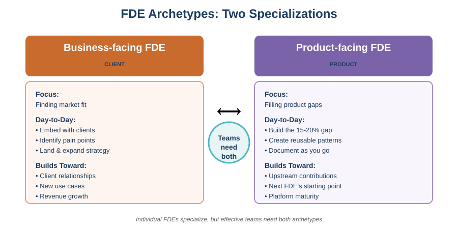
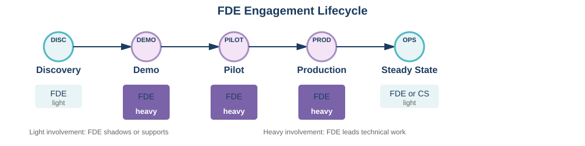

# FDE Startup Kit
## Quick Reference for Getting Started

> **📍 Primary Entry Point**: This is the main starting point for the FDE Advisory Materials MVP. Use this guide to understand FDE essentials, then dive into the detailed practice areas as needed.

---

## What Is an FDE?

Forward Deployed Engineers are **technical, client-facing problem solvers** who:

- Own client outcomes (not just tasks)
- Build on and extend the platform for specific client needs
- Work across the full stack as needed
- Tolerate ambiguity, broken systems, and missing documentation

**FDEs are NOT:**

- Staff augmentation (we own outcomes, not hours)
- Pure consultants (we build working software, not PowerPoints)
- Support engineers (we deploy new solutions, not maintain old ones)

---

## FDE Archetypes

FDEs specialize into two main archetypes, each solving different problems in the deployment lifecycle:

| Archetype | Focus | Day-to-Day | Builds Toward |
|-----------|-------|------------|---------------|
| Business-facing | Finding market fit | Embed with clients, identify pain points, land & expand | Client relationships, new use cases |
| Product-facing | Filling product gaps | Build the 15-20% the product doesn't cover | Upstream contributions, next FDE's starting point |

  

### Which Do You Need?

- **Early stage** (0-10 deployments): Start with product-facing FDEs to build reusable patterns
- **Scaling stage** (10+ deployments): Add business-facing FDEs to drive land & expand
- **Most orgs need both**: Individual FDEs specialize, but the team requires both archetypes

### Mapping Existing Roles

Your organization may already have people doing FDE work under different titles:
- Solutions engineers with strong technical skills → Business-facing FDEs
- Platform engineers who work on client projects → Product-facing FDEs
- "Technical consultants" who own outcomes → Either archetype

→ See [Hiring & Talent Strategy](01-hiring-talent-strategy.md) for how to evaluate candidates for each archetype.

---

## The Four Teams

| Team | Owns | Typical Work |
|------|------|--------------|
| **FDE** | Client outcomes | Deployments, customization, demos, client relationships |
| **Product** | Product functionality | Features, roadmap, core development |
| **Platform** | Shared infrastructure | APIs, tools, common capabilities |
| **Commercial** | Revenue | Sales, contracts, client acquisition |

---

## FDE Engagement Lifecycle

  

**Discovery:** Understand client problem. FDE may shadow or support Product team.

**Demo:** Build client-specific demonstration. FDE leads if Product has done 2+ deployments.

**Pilot:** Prove the solution works. FDE leads technical work. 8-10 weeks typical.

**Production:** Get solution live. FDE owns through stabilization.

**Steady State:** Ongoing support. May transition to Customer Success.

---

## Quick Reference: Who Does What

| Situation | Who Leads | Who Supports |
|-----------|-----------|--------------|
| First demo for a new product | Product | FDE shadows |
| Demo for product with 3+ deployments | FDE | Product available |
| Pilot technical work | FDE | Product on-call |
| Client environment issues | FDE | Platform on-call |
| Feature doesn't exist | FDE builds workaround | Product considers roadmap |
| Bug in core product | Product fixes | FDE provides reproduction |

---

## FDE Metrics & Performance

---

### Organizational Metrics: Track These

These apply across your entire FDE team and help you understand program health:

| Metric | What It Measures | Watch Out For |
|--------|------------------|---------------|
| **Deployments per FDE** | Throughput and capacity | >5 active = overloaded; <2 = underutilized or blocked |
| **Revenue per FDE** | Commercial efficiency | Trending down = inefficient engagements or wrong accounts |
| **Time-to-value (new deployment)** | How fast you deliver value | Trending up = process debt or technical friction |
| **Environment setup time** | Technical enablement quality | >4 hours = documentation gaps or platform issues |
| **FDE blocked time** | Product-FDE interface health | Trending up = Product team can't support field needs |

→ Track these monthly. Share trends with leadership. Investigate outliers.

### Individual FDE Performance: Intentionally Subjective

Unlike traditional engineering roles, **individual FDE metrics should remain subjective**. This is a feature, not a bug.

**Why subjective evaluation works better:**

- FDEs move between projects with wildly different complexity
- Impact is often indirect (unblocking others, documentation, client relationships)
- Hard problems don't correlate with countable outputs
- Context matters more than numbers

**How Palantir does it:**

- Manager judgment is the primary signal
- Peer feedback and client satisfaction carry significant weight
- FDEs "plead their case" with narrative evidence
- No formulas or scorecards for individual ratings

### Anti-Patterns: Don't Measure These

| Metric | Why It Backfires |
|--------|------------------|
| Lines of code / PRs merged | Misses client-facing work (calls, debugging, demos) |
| Tickets closed | Incentivizes easy tickets over hard problems |
| Utilization rate | Rewards being busy over being effective |
| Time on single account | Ignores that some accounts need more time |

### Customer-Centric Indicators (Leading Signals)

While individual FDE metrics stay subjective, customer feedback provides leading indicators:

- **Client NPS or satisfaction scores** - Direct signal on FDE effectiveness
- **Renewal/expansion rates** - Client sees value, wants more
- **Reference willingness** - Ultimate vote of confidence

Track these per engagement, not per FDE.

---

## FDE Hiring: Key Traits

| Must Have | Red Flag |
|-----------|----------|
| Technical breadth (full-stack capable) | "I only do backend" |
| Learns quickly | Needs extensive training |
| High pain tolerance | Escalates instead of problem-solving |
| Clear communication | Talks past the audience |
| Ownership mindset | "That's not my job" |

**Interview Process:**

1. Phone screen (15-30 min) - Basic communication check
2. Tech screen (60 min) - Verify competence
3. Learning & Reengineering (60 min) - Navigate unfamiliar system
4. Decomposition (60 min) - Break down complex problem
5. Hiring manager (45-60 min) - Thesis validation

---

## Product Team Checklist for FDEs

Before FDEs can work with your product, you MUST provide:

- [ ] **Single code repository** (or clear multi-repo guide)
- [ ] **Working README** that actually gets someone to running code
- [ ] **Data model documentation** (what entities, what relationships)
- [ ] **API documentation** (endpoints, formats, auth)
- [ ] **Configuration guide** (what's customizable without code)
- [ ] **Demo environment** (always available, resettable)
- [ ] **Response SLA** (blockers addressed within 24 hours)

**Target:** New FDE can go from "I have access" to "I can make changes" in < 4 hours.

---

## FDE Operating Principles

### 1. Own the Outcome
Don't wait for someone else. If the client needs it, figure out how to deliver it.

### 2. Document As You Go
When you figure something out, write it down immediately. Submit PR same day.

### 3. Build for the Next Person
Your workaround becomes the next FDE's starting point. Make it understandable.

### 4. Escalate Smart
Try to solve it first. When you escalate, bring: what you tried, what happened, what you need.

### 5. Feed Back Patterns
When you see the same request from multiple clients, push it toward the product.

### 6. No Long-Lived Branches
If your branch is >2 weeks old, something is wrong. Merge smaller pieces or get it on the roadmap.

---

## Escalation Quick Reference

| Blocked On | First Try | Escalate To | Timeline |
|------------|-----------|-------------|----------|
| Environment setup | Documentation, Slack | Product lead | After 4 hours |
| Missing feature | Workaround | Product roadmap | After client confirms need |
| Bug in product | Reproduce, file issue | Product on-call | If client-impacting |
| Access/permissions | IT ticket | FDE lead | After 24 hours |
| Client relationship | Your manager | Commercial lead | Before it's critical |

---

## Common Failure Modes

| Symptom | Likely Cause | Fix |
|---------|--------------|-----|
| FDEs blocked waiting for Product | Priorities misaligned | Escalate, track blocked time |
| Same question asked repeatedly | Missing documentation | FDE documents, Product merges |
| Demos take weeks to build | No reference demo | Product provides baseline |
| Client expectations missed | Over-promising in sales | FDE in pre-sales conversations |
| FDE burnout | Too much time on one account | Rotate assignments |

---

## Resources

| Need | Where to Go |
|------|-------------|
| Hiring process | [01-hiring-talent-strategy.md](01-hiring-talent-strategy.md) |
| Product team expectations | [02-product-fde-interface.md](02-product-fde-interface.md) |
| Technical standards | [03-technical-enablement.md](03-technical-enablement.md) |
| Resources | [resources/](resources/index.md) |
| Escalation help | Your FDE lead |
| Something not covered | Ask, then document the answer |

---

## Further Reading

External perspectives on Forward Deployed Engineering from practitioners and thought leaders:

- [**The FDE Playbook for AI Startups**](https://www.ycombinator.com/library/Mt-the-fde-playbook-for-ai-startups-with-bob-mcgrew) - Y Combinator podcast with Bob McGrew (former Palantir executive and OpenAI Chief Research Officer) on how FDEs work in AI companies

- [**What are Forward Deployed Engineers, and why are they so in demand?**](https://newsletter.pragmaticengineer.com/p/forward-deployed-engineers) - Pragmatic Engineer's comprehensive overview of the role's origins at Palantir and current adoption across tech

- [**Reflections on Palantir**](https://nabeelqu.co/reflections-on-palantir) - Nabeel Qureshi's insights from 8 years at Palantir on company culture and the FDE model

- [**How to Build Your 1st Forward Deployed Engineering Team**](https://www.peraspera.us/forward-deployed/) - Mark Scianna (former Palantir FDE for 11 years) shares practical guidance on building FDE teams

- [**Sorry, that isn't an FDE**](https://tedmabrey.substack.com/p/sorry-that-isnt-an-fde) - Ted Mabrey (Palantir Head of Commercial) clarifies what makes a true FDE vs. imitations

- [**Understanding Forward Deployed Engineering**](https://www.barry.ooo/posts/fde-culture) - Barry McCardel (Hex CEO) offers a critical perspective on why most companies shouldn't adopt the FDE model

- [**The FDE Manifesto: What Would Stokes Do?**](https://anjor.xyz/writing/2025/11/20/the-fde-manifesto-what-would-stokes-do/) - Tactical principles that define exceptional FDE behavior. 

---

*Version 1.3.2 | Last Updated: February 7, 2026**
